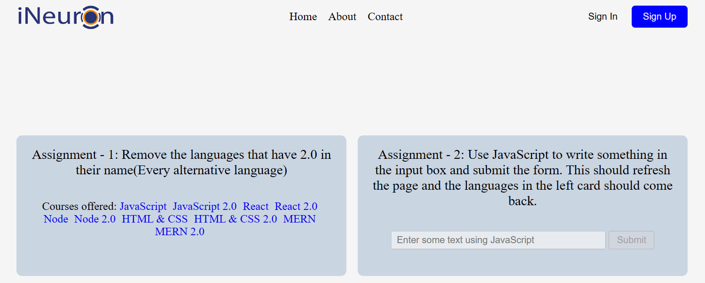
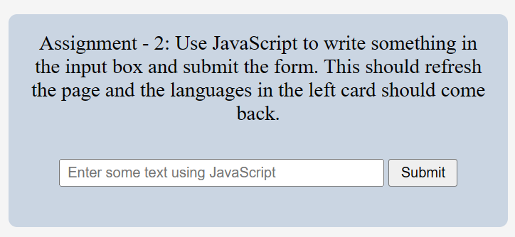

# **DOM Assignment 06**
>**Note**: To complete all the given task.

## **Initial Output**



## Tech Stack


---

## **Task 1**

To remove the languages that have 2.0 in their name(Every alternative language).

### **After Update**


### **Project Solution**

```
const element = document.querySelectorAll(".main__languages a");
element.forEach((i) => {
    let text = i.innerText;
    if(text.includes('2.0')) { 
        i.style.display = "none";
    }
});
```

---

## **Task 2**

To use JavaScript to write something in the input box and submit the form. This should refresh the page and the languages in the left card should come back.

### **After Update**



### **Project Solution**

```
let myInputBox = document.querySelector(".main__form form input");
myInputBox.removeAttribute("disabled");

let myButton = document.querySelector(".main__form form button");
myButton.removeAttribute("disabled");
// location.reload();
myButton.addEventListener("click",(event) => {
    element.forEach((i) => {
        event.preventDefault();
        if(i.innerHTML.includes("2.0")){
            i.style.display = "inline";
        } 
   });
});
```

---